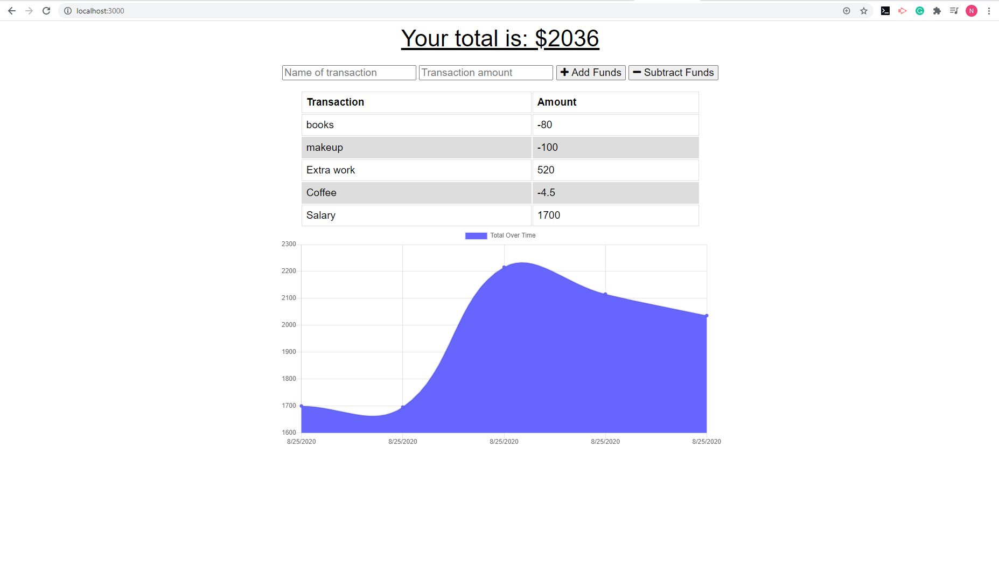

 
  
  # Budget App
  
  ## Description 
  Budget Tracker application allows offline access and functionality.
  The user able to add expenses and deposits to their budget with or without a connection. 
  ## Table of Contents  
  
  * [Usage](#usage)
  * [License](#license)  
 
  ## Usage
  When open the page please enter Name of transaction and amount.After please choose a button -add or subtract funds.Result will show in an area with "total".
  
  ## License
  
  MIT

https://github.com/nata-stelmakh/progressive-budget
  
  
